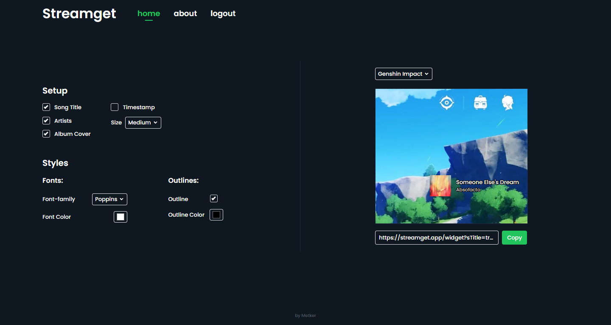

# Streamget (Streaming Widget - Spotify) - ⚒ Work in progress

This is a Spotify widget for streamer works with (OBS, streamlabs, etc). user can insert and get their current play song into their streaming layout.

## Table of contents

- [Streamget (Streaming Widget - Spotify) - ⚒ Work in progress](#streamget-streaming-widget---spotify----work-in-progress)
  - [Table of contents](#table-of-contents)
  - [Overview](#overview)
    - [The challenge](#the-challenge)
    - [Screenshot](#screenshot)
    - [Links](#links)
  - [My process](#my-process)
    - [Design](#design)
    - [Built with](#built-with)
  - [Author](#author)
  - [⚒ Usage](#-usage)
    - [👥 Clone the repo](#-clone-the-repo)
    - [🔐 Setup .env](#-setup-env)
    - [📦 Install dependencies](#-install-dependencies)
    - [✨ Start/Run the app](#-startrun-the-app)

## Overview

### The challenge

Users should be able to:

- Sign in with their spotify account
- Setup & styling the widget.
- See their spotify currently playing song
- Get the widget url for their streaming apps.

### Screenshot



### Links

- Repo URL: [Github](https://github.com/metkerr/streamget.git)

- Live Site URL: [Live on Vercel](https://streamget-metkerr.vercel.app/)

## My process

### Design

- [Mockup design with Figma](https://www.figma.com/file/0VfYnpYFnKhBdYkGPnI4TO/Streamget-Webapp?node-id=0%3A1&t=NZJRgk2wQz7HKSJd-1)

### Built with

- Semantic HTML5 markup
- [Next JS](https://nextjs.org/) - JS Framework
- [Typescript](https://www.typescriptlang.org/) - JS but cooler
- [Tailwind](https://tailwindcss.com/) - For styles
- [Spotify API](https://developer.spotify.com/) - API

## Author

- Website - [Metker](https://metkerr.github.io/)
- Frontend Mentor - [@metkerr](https://www.frontendmentor.io/profile/metkerr)
- Twitter - [@metkerr](https://twitter.com/metkerr)

## ⚒ Usage

### 👥 Clone the repo

```shell
$ git clone https://github.com/metkerr/streamget.git
```

### 🔐 Setup .env

```shell
$ touch .env.local
```

Insert env data:

```
CLIENT_ID=INSERT_YOUR_CLIENT_ID_HERE
CLIENT_SECRET=INSERT_YOUR_SECRET_HERE
NEXTAUTH_URL=http://localhost:3000/api/auth
NEXTAUTH_SECRET=streamget
```

_you can get your CLIENT_ID & CLIENT_SECRET from [spotify developer dashboard](https://developer.spotify.com/dashboard)_

### 📦 Install dependencies

```shell
$ cd streamget
$ npm install
```

### ✨ Start/Run the app

```shell
$ npm run dev
```
